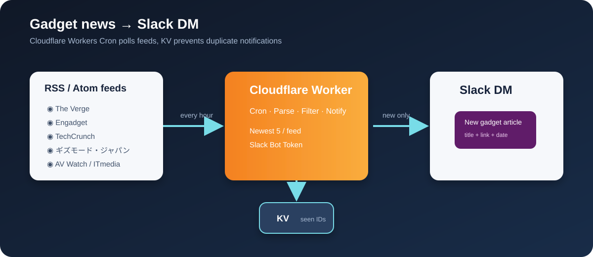

# Slack RSS Notifier

ガジェット系ニュースのRSSをCloudflare WorkersのCronで取得し、新着記事をSlackの自分DMへ転送するCodexプラグインです。



## 使い方

1. [Worker template](assets/worker-template/)をコピーしてWorkerプロジェクトを作成
2. `wrangler.jsonc`のKV namespace IDを設定
3. Slackアプリに`chat:write`と`im:write`を付与してワークスペースへインストール
4. Wrangler Secretを登録

```powershell
npx wrangler secret put SLACK_BOT_TOKEN
npx wrangler secret put SLACK_USER_IDS
npx wrangler secret put ADMIN_TOKEN
```

5. `npm install`、`npx wrangler types`、`npm test`を実行
6. `npx wrangler deploy --dry-run`で確認してから`npx wrangler deploy`

デプロイ後はスマホで`https://<worker-name>.<account>.workers.dev/setup`を開き、`ADMIN_TOKEN`を入力して「今すぐ実行」を押すと動作確認できます。

`SLACK_USER_IDS`には友達を含む通知先のSlack User IDをカンマ区切りで指定します。同じワークスペースの友達なら、友達にSlackプロフィールから「メンバーIDをコピー」してもらい、そのIDを管理者がSecretへ追加するだけです。詳しい手順、フィード追加方法、Cron変更、手動実行、トラブルシューティングは[Worker README](assets/worker-template/README.md)を読んでください。

## プラグインとして使う

プラグインマニフェストは[`.codex-plugin/plugin.json`](.codex-plugin/plugin.json)、Codex用の手順は[`skills/slack-rss-notifier/SKILL.md`](skills/slack-rss-notifier/SKILL.md)にあります。

## 初期フィード

The Verge、Engadget、TechCrunch、9to5Google、ギズモード・ジャパン、AV Watch、ITmedia Mobileを登録しています。`FEEDS`を編集して任意のRSS/Atomフィードへ変更できます。

## 注意

Slack Bot Token、管理用トークン、個人情報はコミットしないでください。初回実行では既存記事を通知せず、既読状態だけ登録します。
